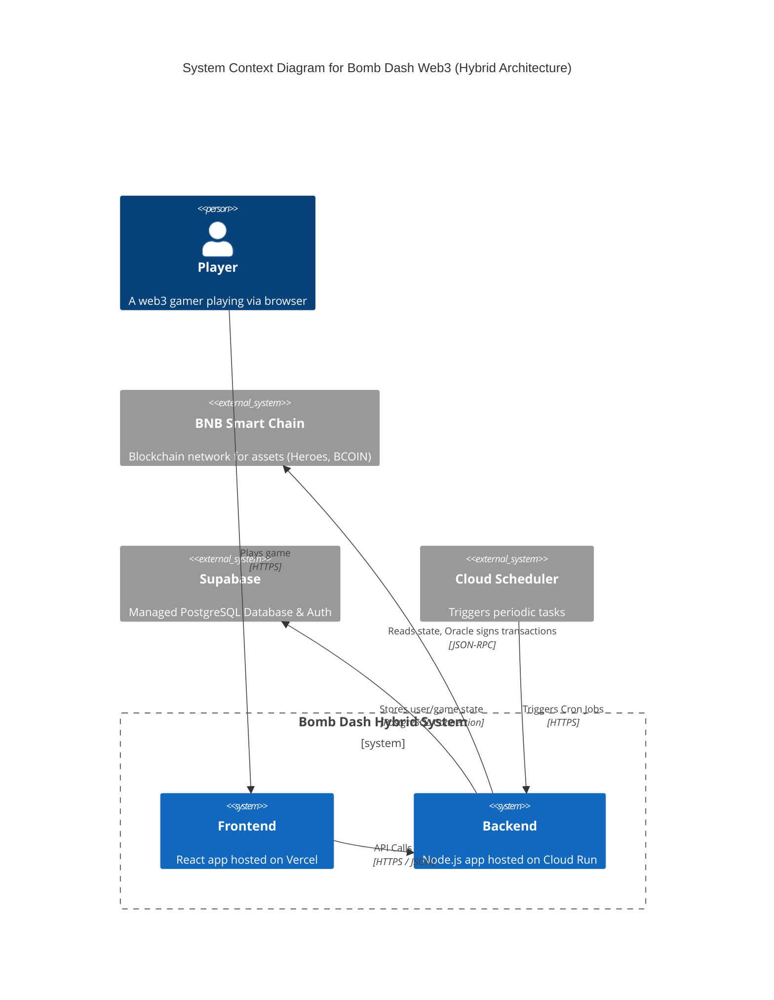
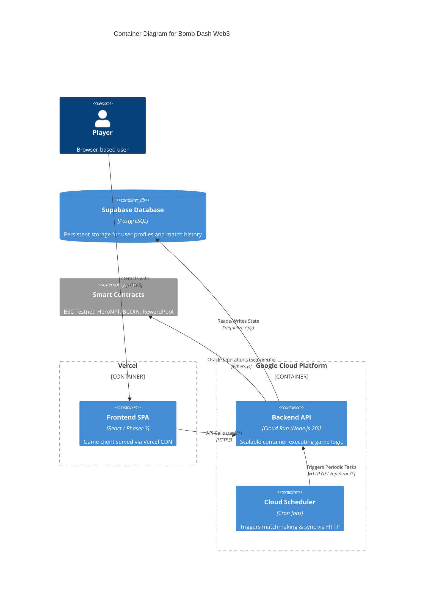
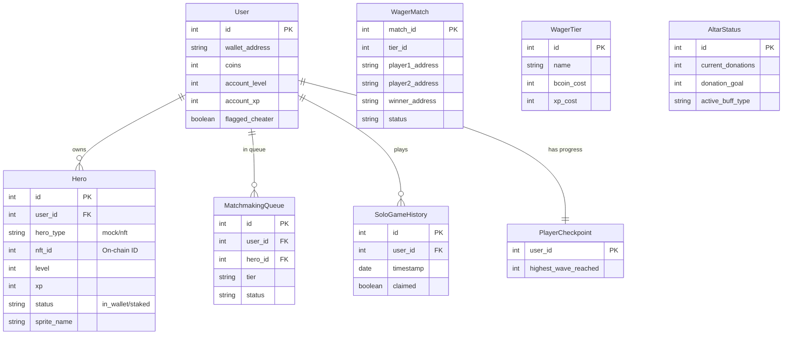
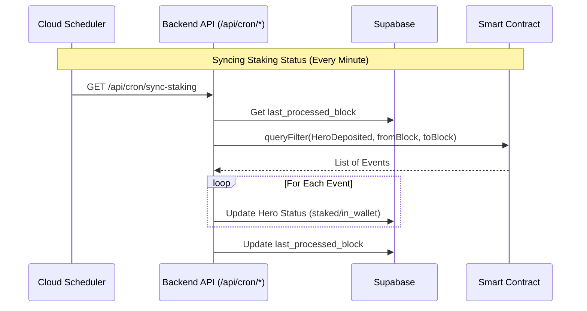

# Architecture & Design (Hybrid Edition)

## System Context (C4 Level 1)

This diagram illustrates the high-level interaction between the User, the Bomb Dash Hybrid System, and external components.

## Container Diagram (C4 Level 2)

The system uses a **Hybrid Architecture** leveraging the best of Vercel and Google Cloud.

## Database Schema (ERD)

The following diagram represents the data model managed by Supabase (PostgreSQL).

## Key Flows & Processes

### 1. Oracle Operations (Cloud Run)

The Oracle logic runs within the Cloud Run container.

- **Trigger**: User requests a withdrawal or reward claim via API.
- **Action**: Backend initializes `ethers.Wallet`, validates request against DB state, signs message, and returns signature.
- **Scaling**: Cloud Run automatically scales instances based on load (0 to N).

### 2. Scheduled Sync (Cloud Scheduler)

We use Google Cloud Scheduler to trigger maintenance tasks.

### 3. PvP Validation (Anti-Cheat)

- **Submission**: Frontend posts match results to `/api/pvp/submit`.
- **Validation**: Backend calculates `MaxDamage = Duration * DPS * 1.2`.
- **Action**: If `ReportedDamage > MaxDamage`, `User.flagged_cheater` is set to `true`.

### 4. Degraded Mode (No Blockchain)

If `ORACLE_PRIVATE_KEY` or `BSC_RPC_URL` are missing:

- **Initialization**: `oracle.initOracle()` returns `false`.
- **Gameplay**: Users can still play with "Mock Heroes".
- **Restrictions**: No NFT verification, On-Chain rewards, or Wagers.
