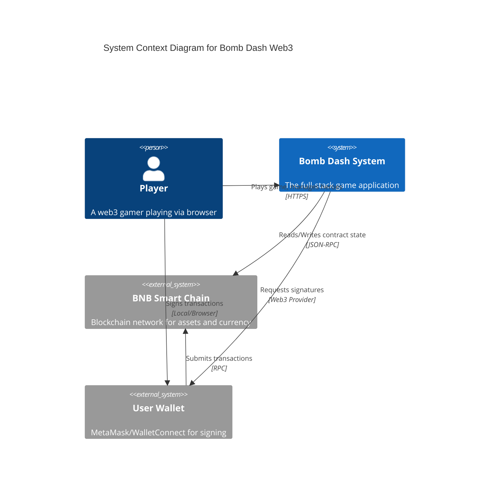
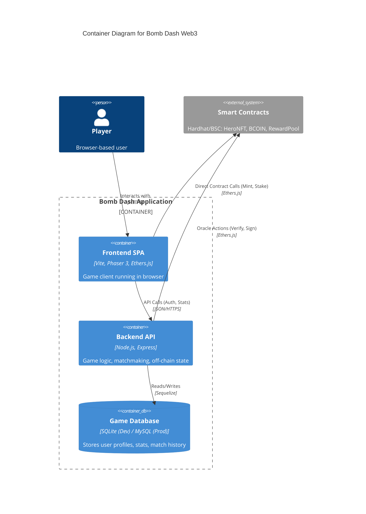
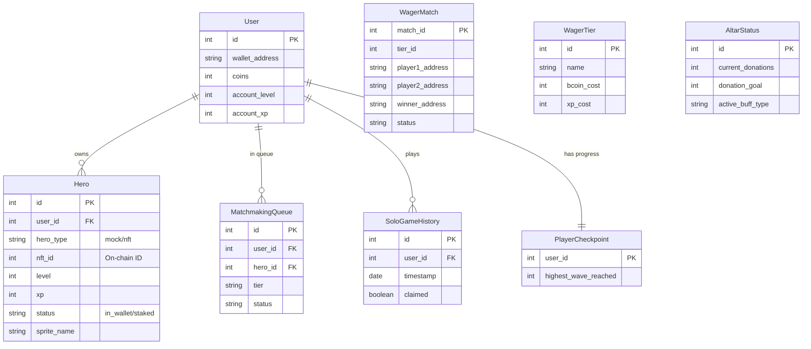
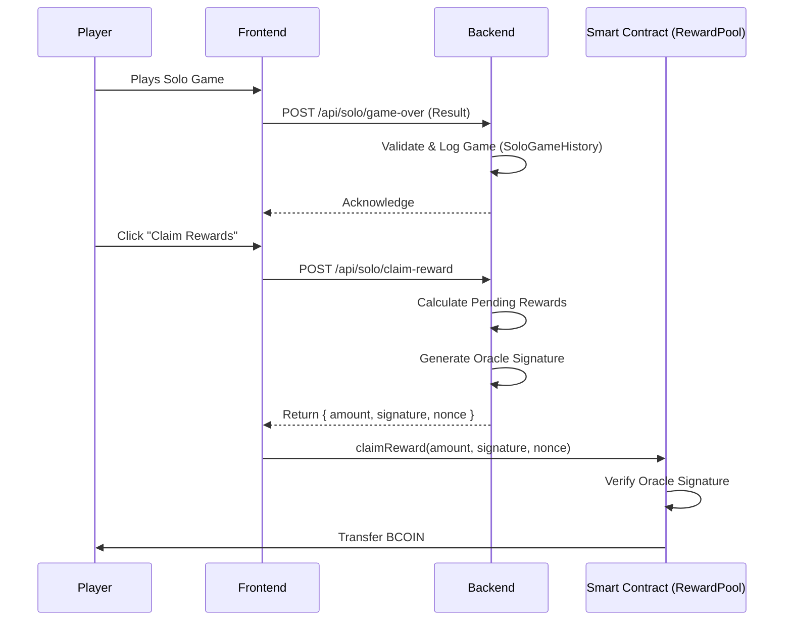

# Architecture & Design

## System Context (C4 Level 1)

This diagram illustrates the high-level interaction between the User, the Bomb Dash Game System, and external Blockchain components.

## Container Diagram (C4 Level 2)

This diagram breaks down the "Bomb Dash System" into its core executable containers.

## Database Schema (ERD)

The following diagram represents the data model managed by the Backend API.

## Key Flows

### 1. Solo Reward Claiming

