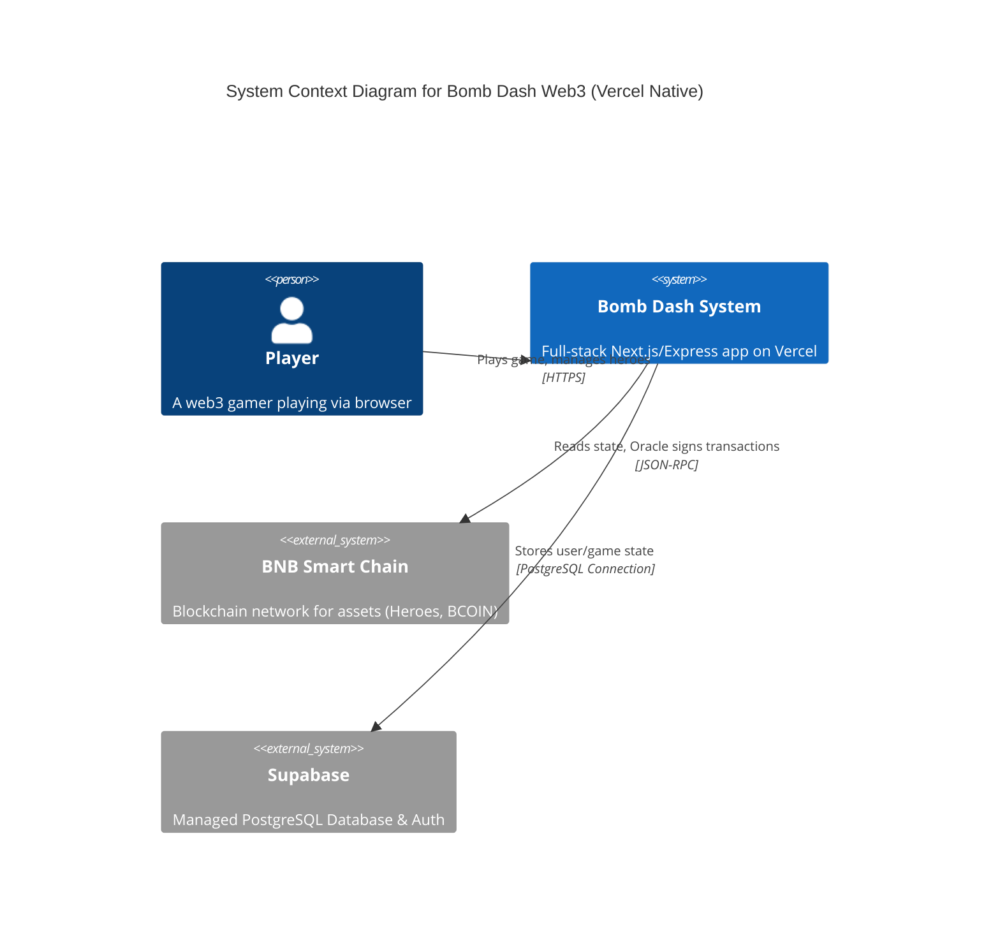
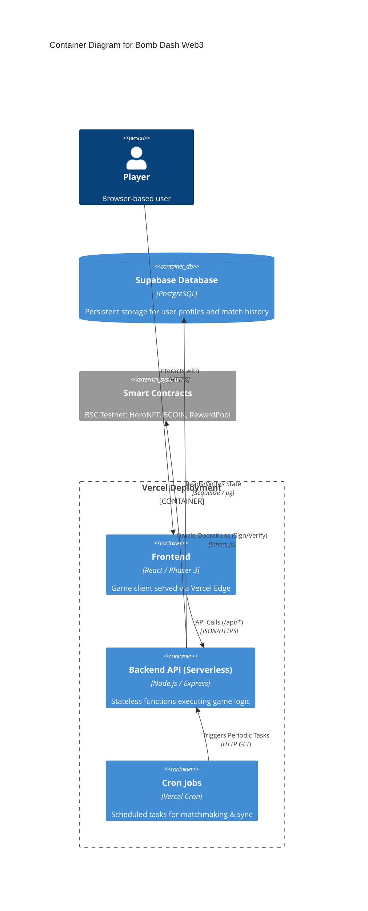
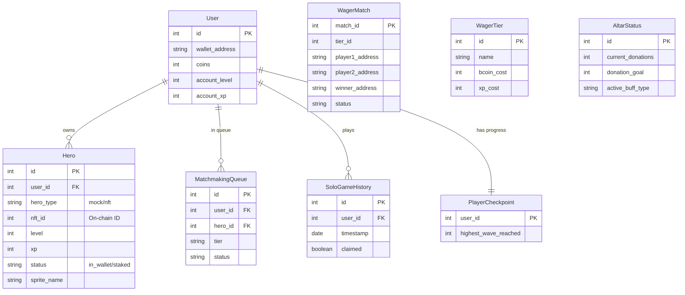
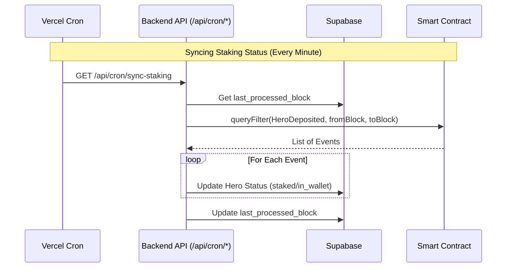

# Architecture & Design (Serverless Edition)

## System Context (C4 Level 1)

This diagram illustrates the high-level interaction between the User, the Bomb Dash Game System (Serverless), and external Blockchain components.

## Container Diagram (C4 Level 2)

The system is deployed as a Serverless application on Vercel.

## Database Schema (ERD)

The following diagram represents the data model managed by Supabase (PostgreSQL).

## Key Flows & Processes

### 1. Serverless "Oracle" Operations

Unlike a persistent server, the Oracle runs on-demand within Vercel Functions.

- **Trigger**: User requests a withdrawal or reward claim.
- **Action**: Backend function spins up, initializes `ethers.Wallet` from env vars, checks logic, signs message, and returns signature.
- **Shutdown**: Function terminates immediately after response.

### 2. Scheduled Sync (Cron Jobs)

Since there is no long-running process to listen for blockchain events, we use polling via Vercel Crons.

### 3. Degraded Mode (No Blockchain)

If `ORACLE_PRIVATE_KEY` or `BSC_RPC_URL` are missing:

- **Initialization**: `oracle.initOracle()` returns `false`.
- **Gameplay**: Users can still play with "Mock Heroes".
- **Restrictions**:
  - No NFT verification.
  - No On-Chain rewards (BCOIN).
  - No PvP Wagers (since they require on-chain escrow).
- **Purpose**: Allows development and testing of the game loop without blockchain dependencies.
