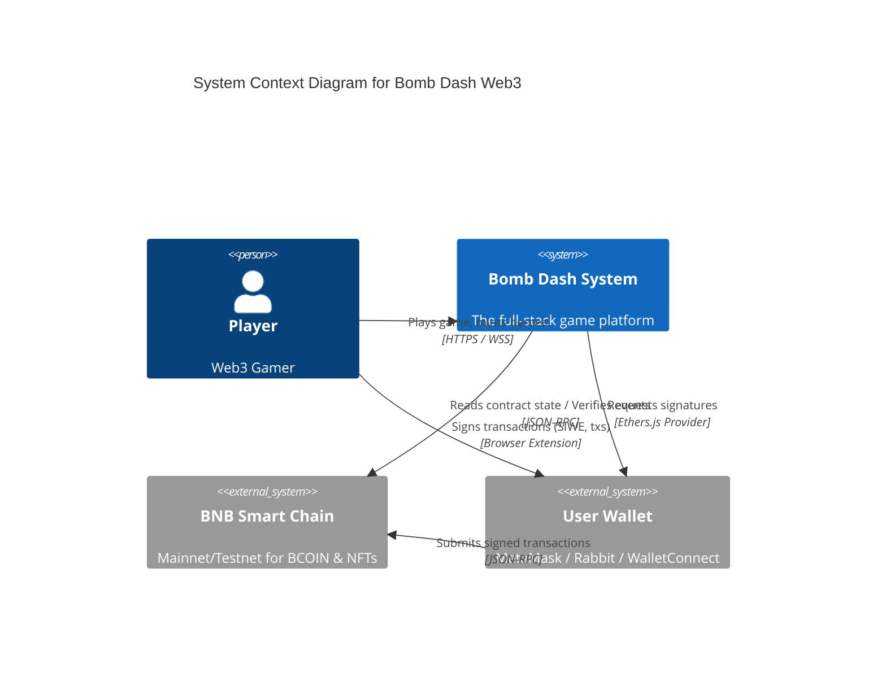
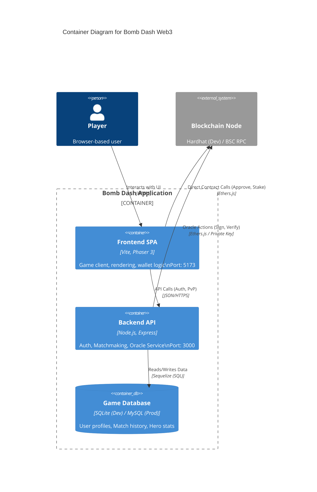
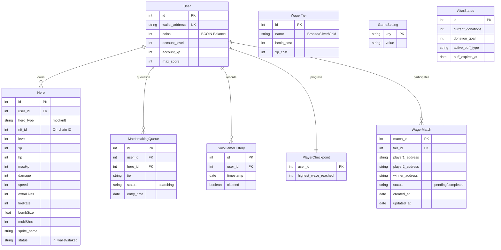
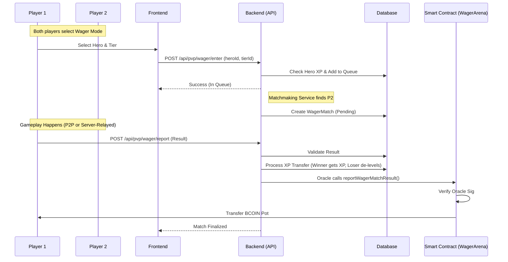

# Architecture & Design

## System Context (C4 Level 1)

High-level interaction between the Player, Bomb Dash System, and External Blockchain.

## Container Diagram (C4 Level 2)

Breakdown of the Bomb Dash System into executable containers.

## Database Schema (ERD)

Detailed data model managed by the Backend API.

## Key Flows

### 1. PvP Wager Match Flow

This flow illustrates how players enter a wager match and how the result is processed.

